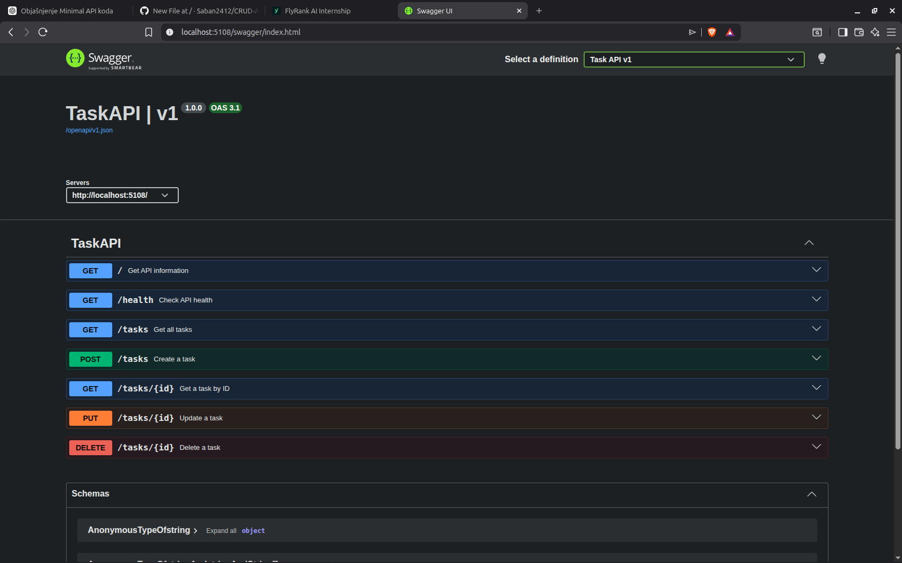

# Task API

A small REST API built with ASP.NET Core Minimal API that manages a to-do list.

The API supports the four basic CRUD operations:

* Create tasks
* Read tasks
* Update tasks
* Delete tasks

The project uses an in-memory list as its data store.

## Technologies

* C#
* ASP.NET Core Minimal API
* .NET 10
* Swagger UI / OpenAPI
* Git and GitHub

## Running the application

Clone the repository and navigate to the project directory:

```bash
git clone git@github.com:YOUR_USERNAME/YOUR_REPOSITORY.git
cd YOUR_REPOSITORY
```

Run the API:

```bash
dotnet run
```

The application will display the local URL in the terminal, for example:

```text
http://localhost:PORT
```

## API Endpoints

| Method | Endpoint      | Description                       |
| ------ | ------------- | --------------------------------- |
| GET    | `/`           | Returns information about the API |
| GET    | `/health`     | Checks whether the API is running |
| GET    | `/tasks`      | Returns all tasks                 |
| GET    | `/tasks/{id}` | Returns a single task             |
| POST   | `/tasks`      | Creates a new task                |
| PUT    | `/tasks/{id}` | Updates an existing task          |
| DELETE | `/tasks/{id}` | Deletes a task                    |

## Task Model

A task has the following structure:

```json
{
  "id": 1,
  "title": "Learn ASP.NET Core",
  "done": false
}
```

## Creating a Task

Request:

```bash
curl -i -X POST http://localhost:PORT/tasks \
  -H "Content-Type: application/json" \
  -d '{"title":"Finish README"}'
```

Example response:

```text
HTTP/1.1 201 Created
```

```json
{
  "id": 4,
  "title": "Finish README",
  "done": false
}
```

## Updating a Task

```bash
curl -i -X PUT http://localhost:PORT/tasks/4 \
  -H "Content-Type: application/json" \
  -d '{"done":true}'
```

## Deleting a Task

```bash
curl -i -X DELETE http://localhost:PORT/tasks/4
```

A successful deletion returns:

```text
204 No Content
```

## Error Handling

The API returns appropriate HTTP status codes:

* `200 OK` — successful request
* `201 Created` — resource successfully created
* `204 No Content` — resource successfully deleted
* `400 Bad Request` — invalid request data
* `404 Not Found` — requested task does not exist

## Swagger UI

The API includes interactive Swagger documentation.

After starting the application, open:

```text
http://localhost:PORT/swagger
```

Swagger UI allows all CRUD operations to be tested directly from the browser using the **Try it out** feature.



## Project Status

Completed as a learning project covering:

* ASP.NET Core Minimal APIs
* HTTP methods and status codes
* CRUD operations
* Request body validation
* OpenAPI and Swagger UI
* Git version control
* GitHub publishing
